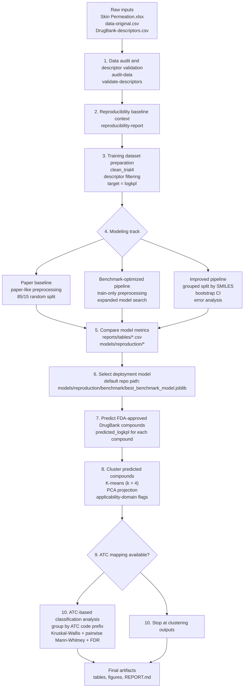

# Predictive Model Development and FDA-Approved Drug Classification Workflow

This workflow translates the current repository into a single end-to-end path for building permeability models and extending the final model to FDA-approved DrugBank compounds.

## End-to-end flow



## Workflow stages

### 1. Data audit and descriptor validation
- Load the uploaded experimental permeability data and DrugBank descriptors.
- Confirm dataset profiles, missingness, and descriptor inventory consistency.
- Generate:
  - `reports/artifacts/data_audit.json`
  - `reports/artifacts/descriptor_validation.json`
  - `reports/tables/dataset_profiles.csv`

### 2. Reproducibility context
- Reconstruct the paper assumptions and record what is reproducible from the uploaded files.
- Document known limitations such as the missing ATC mapping file.
- Generate:
  - `reports/artifacts/reproducibility_report.json`

### 3. Training dataset preparation
- Build the cleaned training table from the skin permeability dataset.
- Keep `logkpl` as the prediction target.
- Preserve compound identity columns such as `Compound` and `SMILES` for grouped evaluation and downstream analysis.

### 4. Model development

#### Paper baseline track
- Reproduce the original notebook logic as closely as possible.
- Use paper-style preprocessing, global scaling before split, and an 85/15 random split.
- Train the baseline model family:
  - MLR
  - Decision Tree
  - RF
  - XGBoost
  - Gradient Boosting
  - CatBoost
  - LightGBM
  - ANN
  - SVR
  - Lasso

#### Benchmark-optimized track
- Keep the paper-style naive split for headline comparison.
- Move preprocessing inside the training workflow and broaden the search space.
- Train stronger individual and ensemble regressors.

#### Improved track
- Use grouped splitting by `SMILES` to reduce leakage from repeated molecules.
- Fit preprocessing on training data only.
- Add bootstrap confidence intervals, applicability-domain analysis, and error analysis.

### 5. Model comparison and selection
- Compare metrics from all three tracks.
- Save fitted models in `models/reproduction/`.
- Use the selected final model for DrugBank inference.
- The current full pipeline defaults to:
  - `models/reproduction/benchmark/best_benchmark_model.joblib`

### 6. FDA-approved DrugBank prediction
- Apply the selected trained model to `data/raw/DrugBank-descriptors.csv` after cleaning.
- Predict `predicted_logkpl` for each FDA-approved compound.
- Generate:
  - `reports/tables/drugbank_predictions_and_clusters.csv`

### 7. FDA-approved drug organization

#### Unsupervised grouping
- Standardize DrugBank descriptor space.
- Evaluate candidate cluster counts and fix `k = 4`.
- Create PCA coordinates for visualization.
- Add applicability-domain flags to identify compounds far from the training domain.
- Generate:
  - `reports/tables/drugbank_cluster_selection.csv`
  - `reports/tables/drugbank_cluster_summary.csv`
  - `figures/drugbank_pca_clusters.png`

#### ATC-based classification
- If an ATC mapping file is present, merge DrugBank predictions with therapeutic classes.
- Reduce ATC codes to the first three characters for group-level analysis.
- Run:
  - Kruskal-Wallis across ATC groups
  - Pairwise Mann-Whitney tests
  - FDR correction
- Generate:
  - `reports/tables/atc_group_distributions.csv`
  - `reports/tables/atc_pairwise_tests.csv`
  - `figures/atc_group_boxplot.png`
  - `figures/atc_pairwise_heatmap.png`

## Recommended execution order

```bash
python scripts/run_full_pipeline.py audit-data
python scripts/run_full_pipeline.py validate-descriptors
python scripts/run_full_pipeline.py reproducibility-report
python scripts/run_full_pipeline.py run-baseline --config configs/paper_baseline.yaml
python scripts/run_full_pipeline.py run-benchmark --config configs/benchmark.yaml
python scripts/run_full_pipeline.py run-improved --config configs/improved.yaml
python scripts/run_full_pipeline.py cluster-drugbank --model-path models/reproduction/benchmark/best_benchmark_model.joblib
python scripts/run_full_pipeline.py run-atc --predictions reports/tables/drugbank_predictions_and_clusters.csv
```

Or run the full workflow in one step:

```bash
python scripts/run_full_pipeline.py full-run --baseline-config configs/paper_baseline.yaml --benchmark-config configs/benchmark.yaml --improved-config configs/improved.yaml
```

## Interpretation note

In this repository, "FDA-approved drug classification" is represented in two downstream ways:
- unsupervised clustering of predicted DrugBank compounds into permeability-related groups
- optional ATC therapeutic grouping when an external ATC mapping file is available

That means the core predictive task is regression on `logkpl`, followed by grouping and therapeutic-class analysis for FDA-approved compounds.
